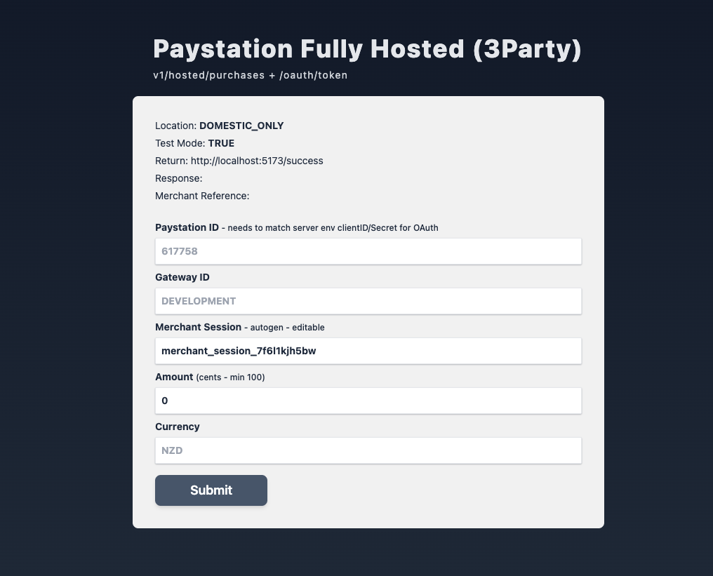
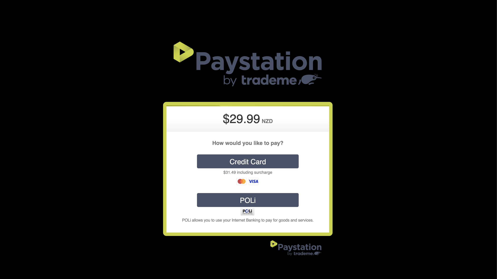
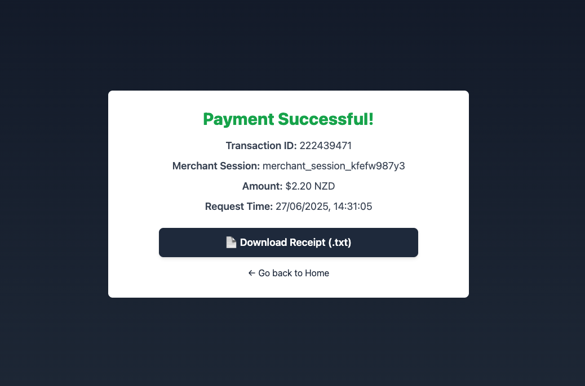
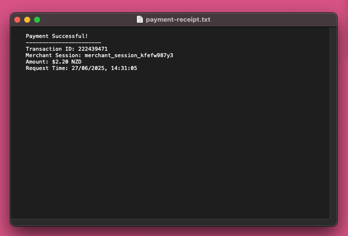

# Paystation Payment Integration

A simple, secure payment flow that connects directly to the Paystation API. It dynamically generates merchant sessions, handles OAuth token authentication, and lets users download TXT receipts for completed transactions.

Tech Stack
Frontend: React, TypeScript, Vite, Tailwind CSS
Backend: Node.js, CORS, Dotenv, OAuth authentication

Requires a .env file in the project root for API keys.

