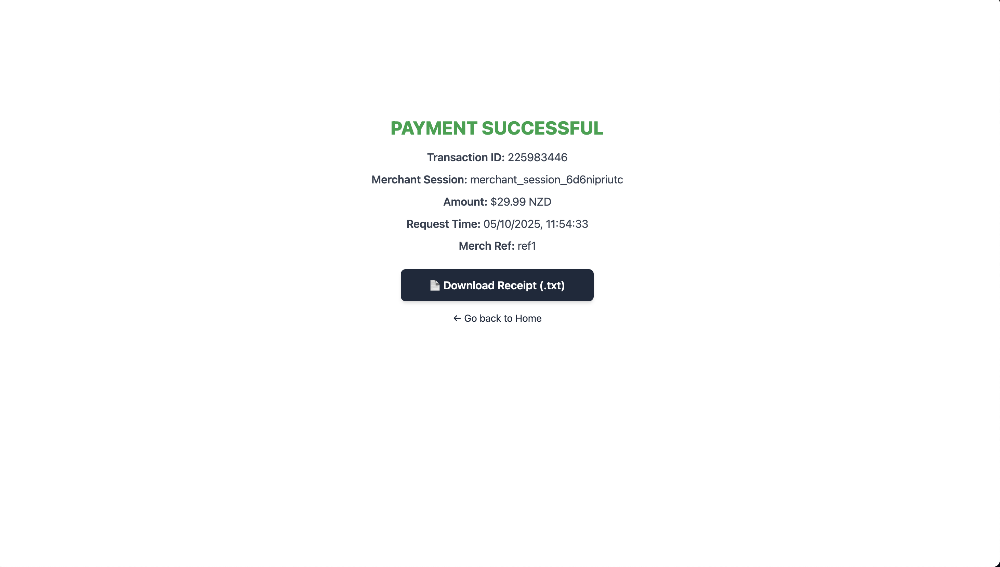

# Paystation Payment Integration

## Features

- Secure Payment Processing via Paystation API
- Dynamically Generated Merchant Sessions
- Downloadable Transaction Receipts (TXT format)
- OAuth-based Authentication (Token Management)

### Frontend

- React, TypeScript, Vite,Tailwind CSS

### Backend

- Node.js, CORS, Dotenv, OAuth-based authentication

### .env

Needs a .env file in your project root with the required secret keys:
